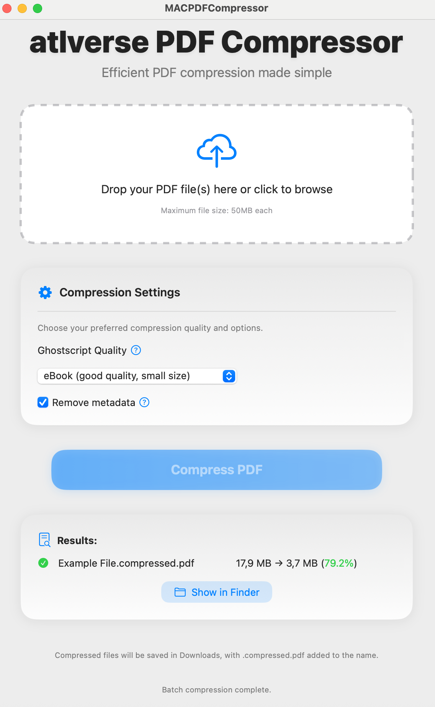

# MAC PDF Compressor

<p align="center">
  
</p>

<p align="center">
  <strong>A native macOS app to compress PDF files with ease.</strong>
  <br />
  Built with SwiftUI for a modern, fast, and intuitive experience on Apple Silicon.
</p>

<p align="center">
  
  
</p>

---

**MAC PDF Compressor** is a powerful yet simple tool that leverages the legendary Ghostscript engine to drastically reduce the size of your PDF files. Whether you're preparing documents for email, web upload, or archiving, this app helps you reclaim storage space without compromising quality.

## ✨ Key Features

-   **📂 Batch Processing:** Drag and drop multiple PDF files at once to compress them all in a single go.
-   **⚙️ Quality Control:** Choose from several compression presets to balance file size and image quality.
-   **🗑️ Metadata Removal:** Optionally strip out metadata to further reduce file size and protect privacy.
-   **📊 Compression Results:** See a clear table with original size, compressed size, and the total space saved.
-   **🚀 Native Performance:** Built with SwiftUI to be lightweight, fast, and perfectly integrated with macOS.
-   **✅ Self-Contained:** The app is designed to work with a bundled `gs` binary, so no external dependencies are needed once built.

## 🛠️ How It Works

The app serves as a user-friendly graphical interface (GUI) for the powerful **Ghostscript (`gs`)** command-line tool. When you add files and start the compression, the app runs Ghostscript in the background with optimized settings to process your PDFs. This combines the simplicity of a modern macOS app with the industrial-strength compression of Ghostscript.

## 🚀 Getting Started (Building from Source)

Since this repository does not include the Ghostscript binary, you'll need to provide it yourself.

### 1. Prerequisites

-   **macOS:** Sonoma (14.0) or later
-   **Hardware:** Apple Silicon Mac (M1, M2, M3, etc.)
-   **Tools:** Xcode 14 or later

> **Note:** This app is built for Apple Silicon and will not run on Intel-based Macs.

### 2. Obtain the Ghostscript Binary

You must have a **statically linked** `gs` binary. This ensures it can be bundled with the app and run without external dependencies.

**Building from Source (Recommended):**
1.  Download the Ghostscript source code from [ghostscript.com](https://ghostscript.com/download/gsdnld.html).
2.  Extract the archive and navigate into the directory in your terminal.
3.  Run the following commands to configure, build, and create a static binary:
    ```sh
    # Configure without shared libraries or unnecessary dependencies
    ./configure --disable-shared --enable-static --without-fontconfig --without-freetype --without-libidn --prefix=/tmp/gs-static

    # Clean and build
    make clean
    make -j$(sysctl -n hw.ncpu)
    make install
    ```
4.  Copy the compiled binary into the project's `Tools` directory:
    ```sh
    cp /tmp/gs-static/bin/gs /path/to/your/project/MACPDFCompressor/Tools/gs
    chmod +x /path/to/your/project/MACPDFCompressor/Tools/gs
    ```

### 3. Build the App

1.  Clone this repository.
2.  Place the `gs` binary in the `MACPDFCompressor/Tools/` directory as described above.
3.  Open `MACPDFCompressor.xcodeproj` in Xcode.
4.  Ensure the `gs` file is included as a target member for the main app.
5.  Build and run the project (Cmd+R).

## 🤝 Contributing

Contributions are welcome! If you have ideas for new features, bug fixes, or improvements, feel free to:
-   Open an issue to discuss your idea.
-   Fork the repository and submit a pull request.

## 📄 License

This project is licensed under the **MIT License**. See the `LICENSE` file for details.
